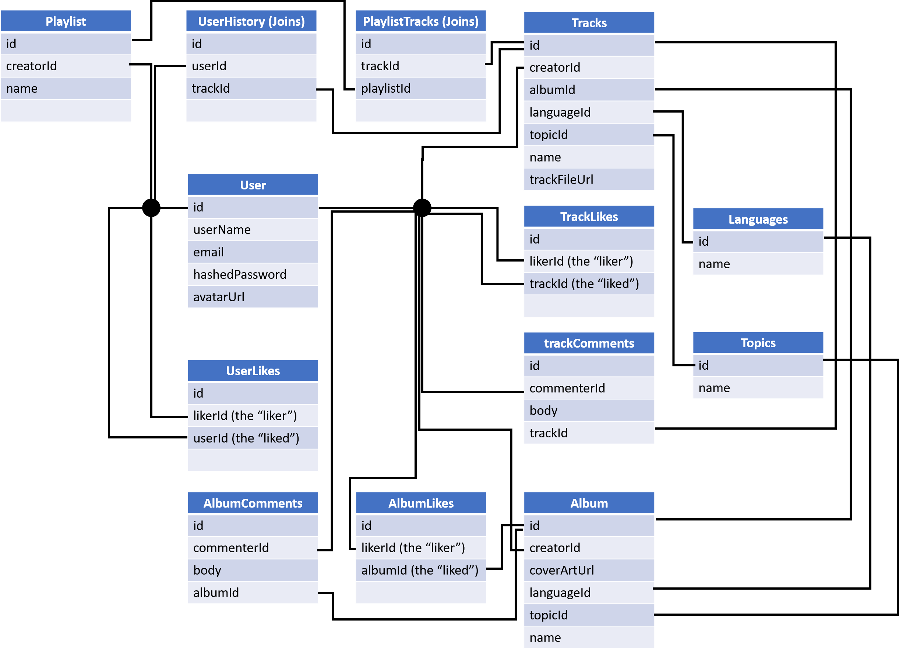
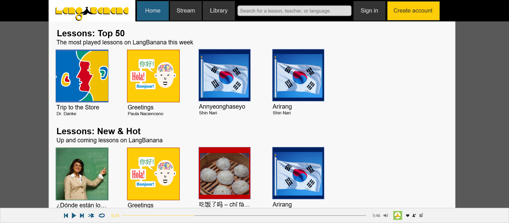

# LangBanana

LangBanana is a premiere website that allows users to search for, create, and listen to content related to language-learning.

## MVP Feature List

LangBanana, a SoundCloud clone, is a website that allows users to upload, search for, and listen to language-learning related content.

### 1. New account creation, log-in, log-out, and guest/demo login

* Users can sign up, log-in, and log-out.
* Users can use a demo log-in to explore features of the site.
* Users can't use certain features without logging in (like uploading content or liking/adding comments to tracks).
* Logged-in users are directed to a home starting page with track suggestions based on their previous listening history.
* Logged-in users can edit their account settings (such as password or avatar).

### 2. Hosting on Heroku

### 3. Searching

* All users can search the site to find content (tracks, albums, playlists, and/or users) related to their search request

### 4. Tracks

* Logged-in users can upload tracks and/or albums to the LangBanana site for other users to listen to.

### 5. Playlists

* Logged-in users can create playlists of selected tracks

### 6. Listening

* Users can listen to selected tracks on the site.

### 7. Commenting and Liking

* Logged-in users can comment on tracks, albums, and other users.
* Logged-in users can like tracks, albums, and other users.

### 8. User Pages

* Logged-in users can access their own user page which displays content about tracks they have listened to, as well as their playlists and any comments from other users about them.

## Database Schema

## Styling Mockup

